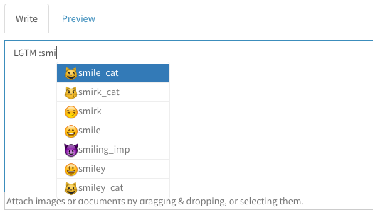

# gitbucket-emoji-plugin  

This plug-in provides Emoji support for GitBucket.

- Convert Emoji directives in Markdown or other places as images
- Suggest Emoji directives in the textarea

See [Emoji cheat sheet for Campfire and GitHub](https://www.webpagefx.com/tools/emoji-cheat-sheet/) to know what emoji are available.

Plugin version | GitBucket version
:--------------|:--------------------
4.5.x          | 4.18.x -
4.4.x          | 4.10.x -
4.3.x          | 4.3.x - 4.9.x

## Installation

Download jar file from [plugin registry](https://plugins.gitbucket-community.org/releases/gitbucket-emoji-plugin) and put into `GITBUCKET_HOME/plugins`.

## Build from source

Run `sbt assembly` and copy generated `/target/scala-2.12/gitbucket-emoji-plugin-assembply-x.x.x.jar` to `~/.gitbucket/plugins/` (If the directory does not exist, create it by hand before copying the jar), or just run `sbt install`.
